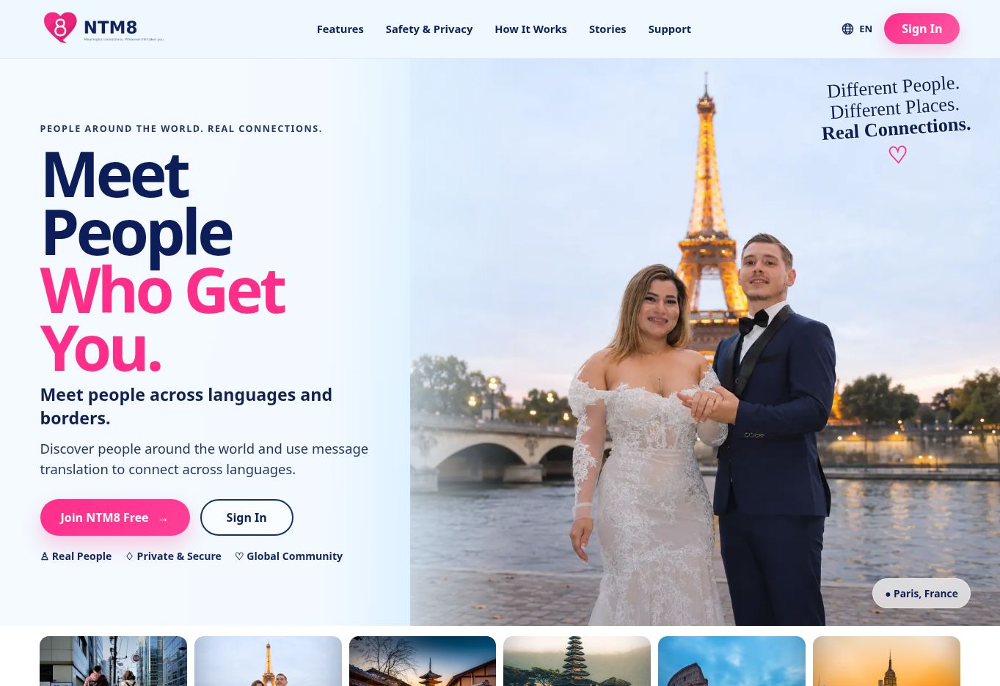

# NTM8 / NT Mate

[Portfolio](../README.md) · [Open NTM8](https://ntm8.com/)

Meet people across languages and borders. NTM8 brings discovery, connections, messaging, translation and photo/video sharing into one member experience.

## Returning and recovering access

Existing members can resend a sign-in link from the email confirmation screen. Expired links provide an action to request a fresh link.

## Holiday portraits

[Thanksgiving](https://ntm8.com/thanksgiving) and [Christmas](https://ntm8.com/christmas) portraits have a **View my photos** option for returning visitors. Verify the same email used for the portraits to browse saved results and download unlocked images. The gallery supports returning without uploading another photo.

## Member journey

Select **Start sharing** on the homepage to begin registration. Complete email verification and adult confirmation to reach the media experience. Discovery has a separate profile setup. **Available now** expresses willingness to connect.

The wallet provides Sparks transaction history, running balances and active holds separately from available spending. Monthly Sparks allocation offers are presented first, with other offers available under additional options. Exact prices, renewal terms and enabled services are shown in the product.

Where enabled, Studio offers image effects and photo-to-video creation from owned media. Review the current quote and available choices before submission. Results follow the product's ownership, visibility and moderation controls. See [Studio media](../docs/studio-media.md) and [latest updates](../docs/latest-updates.md).

People, synthetic profiles and AI assistants need clear explanations and consistent labels; further category design remains separate work. Account, membership, service configuration and release status affect available actions. This showcase does not claim every AI or payment feature is enabled for every member.

[Architecture](../docs/architecture.md) · [Product journeys](../docs/product-journeys.md)
